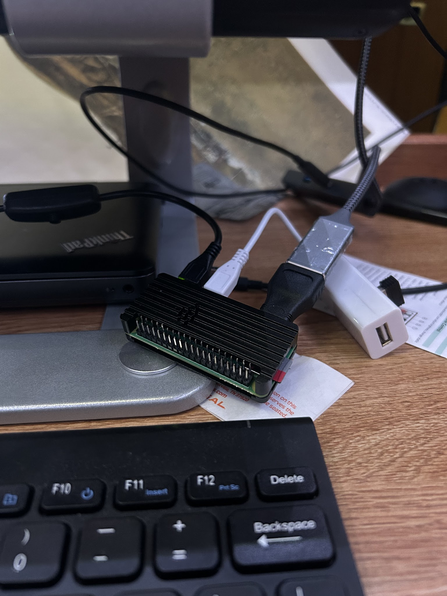
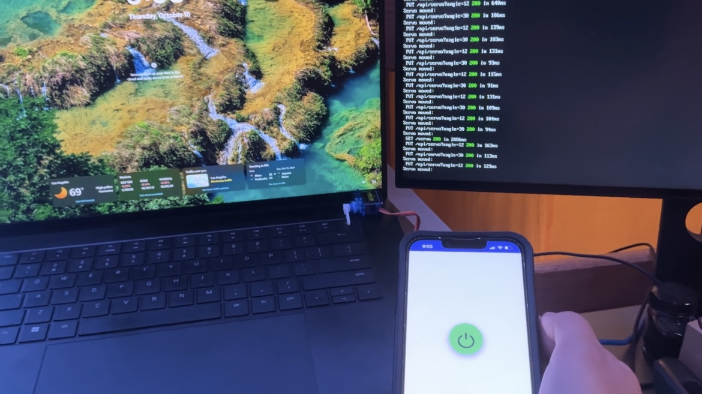
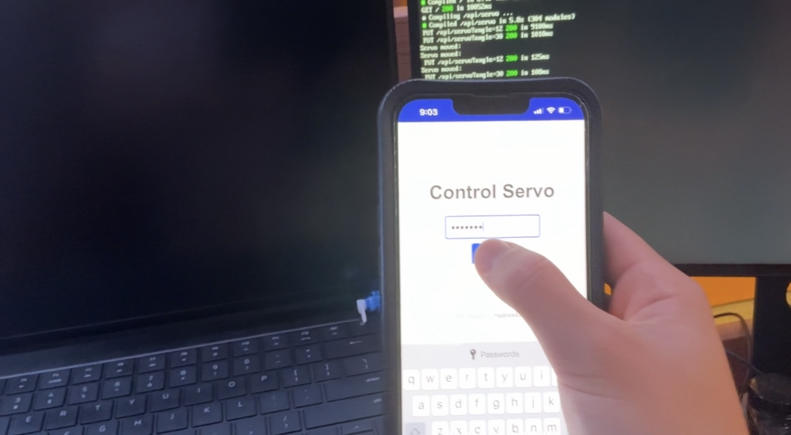

# 🏠 Raspberry Pi Dorm Remote Dashboard

A full-stack IoT dashboard for monitoring and controlling your dorm room devices using a **Raspberry Pi Zero W**.  
This project provides a **secure, real-time interface** for viewing system performance and remotely interacting with connected hardware such as **lights or a PC power button**.

---

## 🔧 Features

- 📈 **Real-Time Monitoring**  
  Track your Raspberry Pi’s **CPU usage** and **RAM usage** through live updates.

- 🌐 **Responsive Web Interface**  
  Built with **Next.js**, the dashboard is mobile-friendly and loads instantly on any device.

- 🐍 **Python Backend**  
  A lightweight backend using Python scripts handles system queries and hardware interactions.

- 🔐 **Secure Authentication**  
  Simple login system to restrict dashboard access to authorized users only.

- 💡 **Remote Device Control**  
  Send commands to the Pi to control:
  - Lights (via GPIO)
  - PC power button (via relay/servo)

- 💾 **Raspberry Pi as Web Server**  
  The entire dashboard is self-hosted on the Raspberry Pi, accessible from your LAN or via port forwarding.

---

## 🖼️ Screenshots




## 🧰 Tech Stack

| Component       | Technology         |
|----------------|--------------------|
| Frontend       | Next.js (React)    |
| Backend        | Python (Flask or custom HTTP) |
| Server Device  | Raspberry Pi Zero W |
| Communication  | RESTful HTTP / WebSocket |
| Auth           | Simple session/token login |
| GPIO Control   | `RPi.GPIO` or `gpiozero` |

---

## 📡 GPIO Wiring
| Device       | GPIO Pin | Notes                                               |
|--------------|----------|-----------------------------------------------------|
| Light Relay  | GPIO 17  | Controls 5V relay module                            |
| PC Trigger   | GPIO 18  | Connected to servo or transistor for power button   |
| Status LED   | GPIO 21  | Optional feedback LED                               |


## 📦 Installation

### ⚙️ Prerequisites

- Raspberry Pi with Raspbian OS
- Python 3 and `pip`
- Node.js and `npm`
- Internet connection (LAN or Wi-Fi)

### 🔌 Setup Steps

1. **Clone the repo**  
   ```bash
   git clone https://github.com/yourusername/rpi-dorm-dashboard.git
   cd rpi-dorm-dashboard
